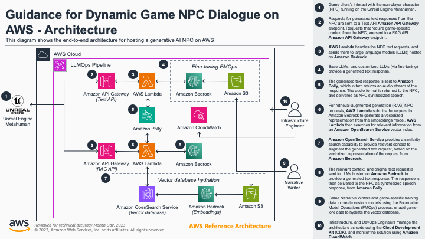
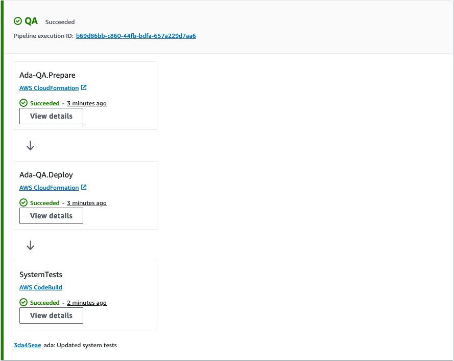
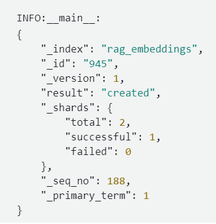

# Guidance for Dynamic Non-Player Character (NPC) Dialogue on AWS

## Table of Content (required)

1. [Overview](#overview)
    - [Architecture](#architecture)
    - [Cost](#cost)
2. [Prerequisites](#prerequisites)
    - [Operating System](#operating-system)
    - [Third-party tools](#third-party-tools)
    - [AWS account requirements](#aws-account-requirements)
    - [aws cdk bootstrap](#aws-cdk-bootstrap)
    - [Supported Regions](#supported-regions)
3. [Deployment Steps](#deployment-steps)
4. [Deployment Validation](#deployment-validation)
5. [Running the Guidance](#running-the-guidance)
    - [Quality Assurance](#quality-assurance)
    - [Hydrating the vector store](#hydrating-the-vector-store)
    - [Unreal Engine sample project](#unreal-engine-sample-project)
6. [Next Steps](#next-steps)
7. [Cleanup](#cleanup)

## Overview

Typical player interactions with NPCs are static, and require large teams of script writers to create static dialog content for each character, in each game, and each game version to ensure consistency with game lore. This Guidance helps game developers automate the process of creating a non-player character (NPC) for their games and associated infrastructure. It uses Unreal Engine MetaHuman, along with foundation models (FMs), for instance the large language models (LLMs) Claude 2, and Llama 2, to improve NPC conversational skills. This leads to dynamic responses from the NPC that are unique to each player, adding to scripted dialogue. By using the Large Language Model Ops (LLMOps) methodology, this Guidance accelerates prototyping, and delivery time by continually integrating, and deploying the generative AI application, along with fine-tuning the LLMs. All while helping to ensure that the NPC has full access to a secure knowledge base of game lore, using retrieval-augmented generation (RAG).

### Architecture



### Cost

_You are responsible for the cost of the AWS services used while running this Guidance. As of January 2024, the cost for running this Guidance with the default settings in the `us-east-1` (N. Virginia) AWS Region is approximately $248.57 per month for processing 100 records._

For example, the following table shows a break-down of approximate costs _(per month)_ to process 100 requests, using an **Amazon OpenSearch Service** vector database for RAG:

|     **Service**    | **Cost (per month)** |
|:------------------:|:--------------------:|
| OpenSearch Service | $243.65              |
| SageMaker          | $1.43                |
| S3                 | $1.67                |
| CodeBuild          | $0.34                |
| Secrets Manager    | $1.20                |
| Bedrock            | $0.30                |
|      **Total**     | **248.57**           |


## Prerequisites

### Operating System

These deployment instructions are optimized to best work on a pre-configured **Amazon Linux 2023** [AWS Cloud9](https://aws.amazon.com/cloud9/) development environment. Refer to the [Individual user setup for AWS Cloud9](https://docs.aws.amazon.com/cloud9/latest/user-guide/setup-express.html) for more information on how to set up Cloud9 as a user in the AWS account. Deployment using another OS may require additional steps, and configured python libraries (see [Third-party tools](#third-party-tools)). 

>__NOTE:__ A Github [dev container](https://docs.github.com/en/codespaces/setting-up-your-project-for-codespaces/adding-a-dev-container-configuration/introduction-to-dev-containers) configuration has been provided should you wish to use [GitHub codespaces](https://docs.github.com/en/codespaces), or [Visual Studio Code Dev Containers](https://code.visualstudio.com/docs/devcontainers/containers) as your development environment.

### Third-party tools

Before deploying the guidance code, ensure that the following required tools have been installed:

- AWS Cloud Development Kit (CDK) >= 2.125.0
- Python >= 3.8
- NodeJS >= 18

>__NOTE:__ The Guidance has been tested using AWS CDK version 2.125.0. If you wish to update the CDK application to later version, make sure to update the `requirements.txt`, and `cdk.json` files, in the root of the repository, with the updated version of the AWS CDK.

- Unreal Engine 4.26 or 4.27
- Microsdoft Visual Studio Code for Unreal Engine 4 C++ development.

>__NOTE:__ If you need help with these setup steps, refer to the Unreal Engine 4 documentation, especially "Setting Up Visual Studio for Unreal Engine". The  was only tested with Visual Studio 2019 with Unreal Engine 4.27. The Unreal Engine sample __DOES NOT__ work with Ureal Engine 5.

### AWS account requirements

This deployment requires that you have an existing [Amazon SageMaker Domain](https://docs.aws.amazon.com/sagemaker/latest/dg/sm-domain.html) in your AWS account. A SageMaker Domain is required in order to provide access to monitor, and track the following SageMaker resources:

- SageMaker Pipelines
- SageMaker Model Registry

>__NOTE:__ See the [Quick onboard to Amazon SageMaker Domain](https://docs.aws.amazon.com/sagemaker/latest/dg/onboard-quick-start.html) section of the __Amazon SageMaker Developer Guide__ for more information on how to configure an __Amazon SageMaker Domain__ in your AWS account. 

- Bedrock Model Access
    - Anthropic Claude
    - Amazon Titan Embeddings G1 - Text

>__NOTE:__ AWS accounts do not have access to models by default, see the [Model access](https://docs.aws.amazon.com/bedrock/latest/userguide/model-access.html) section of the __Amazon Bedrock User Guide__ to request access to the `Claude v2`, and `Titan Embeddings` foundation models.

### aws cdk bootstrap

This Guidance uses AWS CDK. If you are using `aws-cdk` for first time, please see the [Bootstrapping](https://docs.aws.amazon.com/cdk/v2/guide/bootstrapping.html) section of the __AWS Cloud Development Kit (AWS CDK) v2__ developer guide, to provision the required resources, before you can deploy AWS CDK apps into an AWS environment.


### Supported Regions

All features for this guidance are only available in the _US East (N. Virginia)_ and _US West (Oregon)_ AWS regions.

## Deployment Steps

1. In the Cloud9 IDE, use the terminal to clone the repository:
    ```bash
    git clone https://github.com/aws-solutions-library-samples/guidance-for-dynamic-game-npc-dialogue-on-aws dynamic-npc
    ```
2. Change to the repository root folder:
    ```bash
    cd dynamic-npc
    ```
3. Initialize the Python virtual environment:
    ```bash
    python3 -m venv .venv
    ```
4. Activate the virtual environment:
    ```bash
    source .venv/bin/activate
    ```
5. Install the necessary python libraries in the virtual environment:
    ```bash
    python -m pip install -r requirements.txt
    ```
6. Open the `constants.py` file for editing. The following settings can be adjusted to suite your use case:
    - `WORKLOAD_NAME`
        - ___Description:___ The name of the workload that matches your use case. This will be used as a prefix for an component deployed in your AWS account.
        - ___Type:___ String
        - ___Default:___ `"Ada"`
    - `REGION`
        - ___Description:___ The name of the AWS region into which you want to deploy the use case.
        - ___Type:___ String
        - ___Example:___ `"us-east-1"`
    - `SM_DOMAIN_ID`
        - ___Description:___ The ID for your prerequisite __Amazon SageMaker Domain__ in your configured AWS region. You can view the ID for your domain in the [AWS Console](https://console.aws.amazon.com/sagemaker/), or by running the ```aws sagemaker list-domains --query "Domains[*].DomainId" --output text``` command.
        - ___Type:___ String
        - ___Example:___ `"d-abcdef12gh3i"`
    - `QA_ENV_NAME`
        - ___Description:___ The name of the "Quality Assurance" stage of the LLMOps pipeline.
        - ___Type:___ String
        - ___Default:___ `"QA"`
    - `PROD_ENV_NAME`
        - ___Description:___ The name of the "Production" stage of the LLMOps pipeline.
        - ___Type:___ String
        - ___Default:___ `"PROD"`
7. Save the `constants.py` file after updating your use case settings.
8. Verify that the CDK deployment correctly synthesizes the CloudFormation template:
    ```bash
    cdk synth
    ```
9. Deploy the guidance:
    ```bash
    cdk deploy --require-approval never
    ```

## Deployment Validation

To verify a successful deployment of this guidance, open [CloudFormation console](https://console.aws.amazon.com/cloudformation/home), and verify the status of the stack infrastructure stack is `CREATE_COMPLETE`. For example, if your `WORKLOAD_NAME` parameter is `Ada`, CloudFormation will reflect that the `Ada-Toolchain` stack has a `CREATE_COMPLETE` status.

## Running the Guidance

### Quality Assurance

Once the deployment has been validated, you can deploy the infrastructure into the QA stage, as part of an LLMOps pipeline, using the following steps:

1. Once the toolchain stack has been deployed, use the Cloud9 IDE, to initialize the `main` branch:
    ```bash
    rm -rf .git && \
    git init --initial-branch=main
    ```
2. Add the newly **AWS CodeCommit** repository as the upstream origin, substituting the appropriate `WORKLOAD_NAME`, and `REGION` parameters. For example if your `WORKLOAD_NAME` parameter is `Ada`, and the `REGION` is `us-east-1`, the the repository url is `https://git-codecommit.us-east-1.amazonaws.com/v1/repos/ada`,
    ```bash
    git remote add origin https://git-codecommit.<REGION>.amazonaws.com/v1/repos/<WORKLOAD_NAME>
    ```
    >__NOTE:__ The `WORKLOAD_NAME` is lower case.
3. Add the source code to to trigger a CI/CD/CT pipeline execution.
    ```bash
    git add -A
    
    git commit -m "Initial commit"
    
    git push --set-upstream origin main
    ```
4. Open the [CodePipeline](https://console.aws.amazon.com/codesuite/codepipeline/pipelines) console, and click on the LLMOps pipeline for the workload. For example, if your `WORKLOAD_NAME` parameter is `Ada`, CodePipeline will reflect that the `Ada-Pipeline`  is `In progress`.

<p align="center">
    
</p>

Once the `QA` stage of the pipeline has been deplyed, and the `SystemTest` stage action is successful, idicating the backend infrastrcuture is functionaing, you can hydrate the vector store.

### Hydrating the vector store

The following steps will demonstrate how to hydrate the **Amazon OpenSearch Service** vector database for RAG:

1. Use provided copy of [Treasure Island by Robert Louis Stevenson](assets/data/pg120.txt) to test vector store hydration and RAG.
2. Using the AWS Console, navigate to Amazon S3 service, and select the bucket with the following format, `<WORKLOAD NAME>-qa-<REGION>-<ACCOUNT NUMBER>`. For example,  `ada-qa-us-east-1-123456789`.
3. Upload the Treasure Island File, by clicking on the upload button, and selecting the file `pg120.txt` file. This will trigger the **AWS Lambda** function that starts a an **Amazon SageMaker Processing Job** to hydrate the **Amazon OpenSearch Service** database.
3. Open the [SageMaker](https://console.aws.amazon.com/sagemaker) console. Using the navigation panel on the left-hand side, expand the `Processing` option, and then select `Processing jobs`. You'll see a processing job has been started, for example `Ada-RAG-Ingest-01-21-20-13-20`. This jobs executes the process of chunking the ebook data, converting it to embeddings, and hydrating the database. 
4. Clink on the running processing job to view its configuration. Under the `Monitoring`, click the `View logs` link to see see the processing logs for your job in **Amazon CloudWatch**. After roughly 5 minutes, the log stream becomes available, and after clicking on the log stream, you will see that each line of the log output represents the successful processing of a chunk of the text inserted into the vector store. For example:

<p align="center">
    
</p>

>__NOTE:__ The [Treasure Island by Robert Louis Stevenson](assets/data/pg120.txt) is available for reuse under the terms of the Project Gutenberg License, included with the ebook or online at www.gutenberg.org.

### Unreal Engine sample project

An Unreal Engine sample project, [AmazonPollyMetaHuman](https://artifacts.kits.eventoutfitters.aws.dev/industries/games/AmazonPollyMetaHuman.zip), has been provided for download. This sample [MetaHuman digital character](https://www.unrealengine.com/en-US/digital-humans) can be used to showcase dynamic NPC dialog. Use the following steps to integrate the sample MetaHuman with the deployed guidance infrastructure:

1. Download, and extract the [AmazonPollyMetaHuman](https://artifacts.kits.eventoutfitters.aws.dev/industries/games/AmazonPollyMetaHuman.zip) zipped Unreal Engine project.
2. Follow the `README.md` file, to get an overview of the sample project, and the prerequisites configured.
3. From the [CloudFormation console](https://console.aws.amazon.com/cloudformation/home) in your AWS, click the deployed infrastructure stack. Select the `Outputs` tab, and capture the values for `TextApiEndpointUrl`, and `RagApiEndpointUrl`.
4. Launch Unreal Engine and open the sample project, by following the sample project [README](assets/AmazonPollyMetaHuman/README.md).
5. Using the Unreal Editor, select `File` --> `Generate Visual Studio Code Project` to use VS Code for editing source code.
6. Using the Unreal Editor, select `File` --> `Open Visual Studio Code` to open the project for code editing.
7. In VS Code, open the `/Source/AmazonPollyMetaHuman/Private/Private/SpeechComponent.cpp` file for editing.
8. Navigate to the following code section, and replace the `ComboboxUri` variables with the `TextApiEndpointUrl`, and `RagApiEndpointUrl` CloudFormation outputs.
    ```cpp
        void USpeechComponent::CallAPI(const FString Text, const FString Uri)
        {
            FString ComboBoxUri = "";
            FHttpRequestRef Request = FHttpModule::Get().CreateRequest();
            UE_LOG(LogPollyMsg, Display, TEXT("%s"), *Uri);
            if(Uri == "Regular LLM")
            {
                UE_LOG(LogPollyMsg, Display, TEXT("If Regular LLM"));
                ComboBoxUri = "<ADD `TextApiEndpointUrl` VALUE FROM GUIDANCE DEPLOYMENT>";
            } else {
                UE_LOG(LogPollyMsg, Display, TEXT("If Else"));
                
                ComboBoxUri = "<ADD `RagApiEndpointUrl` VALUE FROM GUIDANCE DEPLOYMENT>";
            }
    ```
9. Save the `SpeechComponent.cpp` file, and close VS Code.
10. Using the Unreal Editor, click the `Compile` button to recompile the C++ code.
11. Once the updated code has been compiled, click the `Launch` button to interact with the ___Ada___ NPC.

## Next Steps

Review the [Continuous Tuning using FMOps](https://catalog.us-east-1.prod.workshops.aws/workshops/90992473-01e8-42d6-834f-9baf866a9057/en-US/5-continuous-tuning) section of the **Operationalize Generative AI Applications using LLMOps** workshop for a step-by-step guide to implementing continuous fine-tuning of a custom foundation model for the use case.

## Cleanup

To delete the deployed resources, use the AWS CDK CLI to run the following steps:

1. Using the Cloud9 terminal window, change to the root of the cloned repository:
    ```bash
    cd ~/environment/dynamic-npc
    ```
2. Run the command to delete the CloudFormation stack:
    ```bash
    cdk destroy
    ```
3. When prompted, `Are you sure you want to delete`, enter `y` to confirm stack deletion.
4. Use the [CloudFormation](https://console.aws.amazon.com/cloudformation/home) console to manually delete the following stacks in order. For example, if your `WORKLOAD_NAME` parameter is `Ada`, CloudFormation will reflect that the `QA` stack is `Ada-QA`.
    - <WORKLOAD_NAME>-Tuning
    - <WORKLOAD_NAME>-PROD
    - <WORKLOAD_NAME>QA

>__NOTE:__ Deleting the deployed resources will not delete the __Amazon S3__ bucket, in order to protect any training data already stored. See the [Deleting a bucket](https://docs.aws.amazon.com/AmazonS3/latest/userguide/delete-bucket.html) section of the __Amazon Simple Storage Service__ user guide for the various ways to delete the S3 bucket.